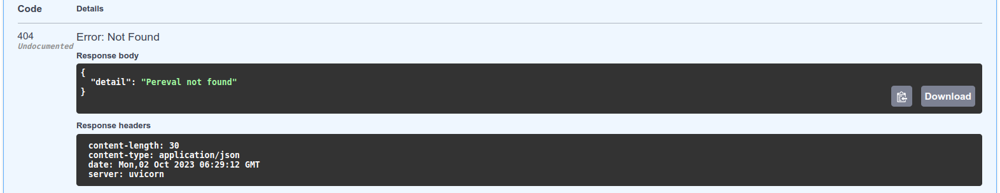

# Pereval

## Описание
Учебный проект Pereval для Федерации Спортивного Туризма России, представляет собой REST API для мобильного приложения. 

### Какую проблему решает проект?
После преодоления очередного перевала, турист заполняет отчёт в формате
_PDF_  и отправляет его на электронную почту федерации. Экспертная группа
ФСТР получает эту информацию, верифицирует, а затем вносит её в базу, которая
ведётся в Google-таблице. Весь процесс очень неудобный и долгий и занимает в среднем
от 3 до 6 месяцев. **Решением данной проблемы служит** - разработка мобильного приложения,
которое упростит туристам задачу по отправке данных о перевале и сократит время обработки запроса
до трёх дней. Пользоваться мобильным приложением будут туристы. В горах они будут вносить данные о
перевале в приложение и отправлять их в ФСТР, как только появится доступ в Интернет. Модератор из федерации
будет верифицировать и вносить в базу данных информацию, полученную от пользователей, а те в свою очередь смогут 
увидеть в мобильном приложении статус модерации и просматривать базу с объектами, внесёнными другими.

## Как использовать проект?
REST API содержит 4 метода для работы:

| **Вызов API**                          |              **Действие**              |
|:---------------------------------------|:--------------------------------------:|
| POST /pereval/                         |           Создание перевала            | 
| GET /pereval/{pereval_id}              |   Получение данных о перевале по id    | 
| GET /pereval/                          | Получение данных о перевалах по e-mail |
| PATH /pereval/{pereval_id}             |       Изменение данных перевала        |
### Создание перевала - POST /pereval/ 
Запрос (позитивный сценарий):

Ответ:

Запрос (позитивный сценарий):

Ответ:

### Получение перевала по id - GET /pereval/{pereval_id}
Запрос (позитивный сценарий):

Ответ:

Запрос данных несуществующего первала (негативный сценарий):

Ответ:

### Получение перевалов по емайл - GET /pereval/   
Запрос (позитивный сценарий):

Ответ:

Запрос данных о перевалах несуществующего пользователя (негативный сценарий):

Ответ:

### Изменение данных о перевале - PATH /pereval/{pereval_id} 
Запрос (позитивный сценарий):

Ответ:

Запрос на изменение данных несуществующего перевала (негативный сценарий):

Ответ:

Запрос на изменение данных перевала, который находится в статусе отличным от "new" (негативный сценарий):

Ответ:

